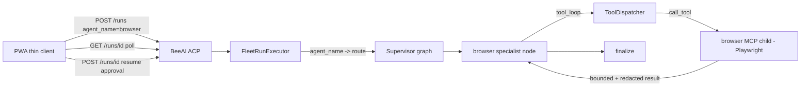

# @Browser Dispatch + PWA Thin Client

Builds on the just-landed tool-use loop (`tool_loop` wired into explorer at [crates/altius-agents/src/supervisor.rs](crates/altius-agents/src/supervisor.rs) line 125, `complete_with_tools` in [crates/altius-agents/src/llm.rs](crates/altius-agents/src/llm.rs)). No mobile auth/SSE/push (deselected).

## Current seams

- MCP client attach exists but is single-purpose and read-only: [crates/altius-mcp/src/agent_lsp.rs](crates/altius-mcp/src/agent_lsp.rs) attaches one stdio child via `rmcp` `RoleClient` and only calls `list_all_tools()` — no `call_tool`.
- Agent tools are executed **locally** by name in [crates/altius-agents/src/tools.rs](crates/altius-agents/src/tools.rs) (`execute_tool` → `detect_output`/`lint_output`); `tool_loop` has no way to reach an external MCP.
- `agent_name` is captured + validated in BeeAI ACP (`Run::new(request.agent_name, ...)` at [crates/altius-protocol/src/beeacp/routes.rs](crates/altius-protocol/src/beeacp/routes.rs) line 146) but `FleetRunExecutor` in [crates/altius-cli/src/serve_command.rs](crates/altius-cli/src/serve_command.rs) reads only `run.input`.
- `FleetRoute` (supervisor.rs) has only `Explorer | Coder | Both`.
- `tower-http = "0.6"` is already a workspace dep (features `cors, trace`) in [Cargo.toml](Cargo.toml) line 46 — needs `fs` for `ServeDir`.

## Dispatch flow

## 1. Generalize MCP client attach (multi-attach + call_tool)

In [crates/altius-mcp/src/agent_lsp.rs](crates/altius-mcp/src/agent_lsp.rs) (rename module to `mcp_client` or add a sibling `attach.rs`; keep `agent_lsp` re-exports for compat):
- Add `AttachedMcp` wrapping `RunningService<RoleClient, ()>` with `list_tools()` (returns `Vec<ToolSpec>`-shaped data) and a new `call_tool(name, args) -> Result<Value>` forwarding to `service.call_tool(...)`.
- Add `McpAttachments`: `HashMap<String, Arc<AttachedMcp>>` keyed by logical name (`"browser"`), with bounded name/count.
- Extend the child-process env policy: keep `env_clear()`, pass a **bounded allowlist** (`PATH`, `HOME`, plus config-supplied extras such as `DISPLAY`/`XAUTHORITY` for headed browsers) instead of only `PATH`.
- Feature: broaden `agent-lsp` feature (or add `mcp-client`) so `rmcp/client` + `rmcp/transport-child-process` cover the browser attach; update [crates/altius-mcp/src/lib.rs](crates/altius-mcp/src/lib.rs) exports.

## 2. Tool dispatcher abstraction

In [crates/altius-agents/src/tools.rs](crates/altius-agents/src/tools.rs):
- Introduce `trait ToolDispatcher { async fn call(&self, call: &ToolCall) -> String }` (result already bounded/redacted).
- `LocalTools` = current `execute_tool` behavior (detect/lint, path-confined).
- `McpTools` forwards to an `Arc<AttachedMcp>` and applies `bounded_redacted` + a **tool-name allowlist by prefix** (e.g. `browser_*`) so a rogue MCP can't surface a dangerous tool Altius blindly calls; cap result bytes (reuse `MAX_TOOL_RESULT_BYTES`).
- Change `tool_loop(...)` to take `&dyn ToolDispatcher` instead of `project_root`; update the explorer call site to pass `LocalTools`.
- Browser `ToolSpec`s come from `AttachedMcp::list_tools()` at graph-build time (namespaced), not hardcoded.

## 3. Browser specialist node + routing

In [crates/altius-agents/src/supervisor.rs](crates/altius-agents/src/supervisor.rs):
- Add `FleetRoute::Browser` and a `browser` `LlmNode` (new `prompts::BROWSER_SYSTEM`) whose `run` uses `tool_loop` with the `McpTools` dispatcher + discovered browser tool specs.
- Extend `build_supervisor_graph` to accept optional `Arc<McpAttachments>`; if no `"browser"` attachment, the browser route degrades to plain LLM (and offline stays deterministic — no tool calls).
- Add a `run_supervisor_*` entry point that accepts `agent_name` (or a `@Browser` prompt prefix) and forces `FleetRoute::Browser`, wired via a conditional edge `router -> browser -> critic -> finalize`.
- Promote `AgentRole::Browser` (or reuse a role) in [crates/altius-agents/src/roles.rs](crates/altius-agents/src/roles.rs).

## 4. Wire attachments + config through the CLI

In [crates/altius-cli/src/serve_command.rs](crates/altius-cli/src/serve_command.rs):
- `FleetRunExecutor` holds `Arc<McpAttachments>` and passes `run.agent_name` into the supervisor so `agent_name == "browser"` routes to the browser node.
- Build attachments at startup from config: env `ALTIUS_BROWSER_MCP_CMD` + `ALTIUS_BROWSER_MCP_ARGS` (JSON array) and/or CLI flags on `FleetServeArgs` in [crates/altius-cli/src/cli.rs](crates/altius-cli/src/cli.rs). Default: **no browser attach** (opt-in). Documented example: `npx @playwright/mcp@latest`.
- Advertise a `browser` skill in the A2A `agent_card`.

## 5. PWA thin client

- Zero-build static SPA under `crates/altius-cli/assets/pwa/`: `index.html`, `app.js` (vanilla), `manifest.webmanifest`, `sw.js`.
- Features: prompt box that `POST /runs` with `agent_name:"browser"`; run list; poll `GET /runs/{id}`; when status `awaiting`, show an **approval card** that resumes via `POST /runs/{id}` (alias `/runs/{id}/resume`); cancel via `POST /runs/{id}/cancel`.
- Serve via `tower-http` `ServeDir` mounted at `/app` in `serve_protocols` (add `fs` feature). Bind stays localhost by default.

## 6. Tests + docs

- Unit: `McpTools` allowlist/bounding; dispatcher swap in `tool_loop` (extend the existing `ScriptedLlm` test); route parsing for `browser`; executor maps `agent_name:"browser"` to the browser route (offline).
- Optional integration behind an env guard using a stub MCP child.
- Update [docs/specs/FLEET_ARCHITECTURE.md](docs/specs/FLEET_ARCHITECTURE.md): §4 add `browser` agent + note tool-use loop is live; §8 move "MCP client-side attach" from future-work to done and add browser dispatch.

## Security invariants preserved

- Browser MCP output is untrusted remote content: bounded + `redact_secrets` before re-entering the model; tool-name allowlist; no path to `TxGuard::submit`/signer from browser tools.
- Child process keeps `env_clear()` + explicit env allowlist; no Altius credentials passed.
- No auth added — API/PWA remain localhost-bound; exposing publicly is called out as requiring the (separate) auth work.

## Out of scope

Mobile auth/bearer, SSE/push notifications, durable Neo4j `RunStore`, SPL x402 — deferred per scope selection.