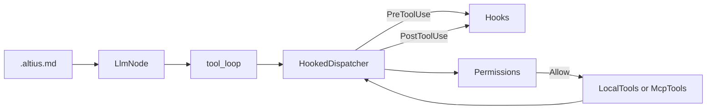

# Harness Phase A: FS tools, hooks, permissions, project memory

## Scope (locked)

**In:** Tier 0.1–0.3 + project memory (`.altius.md`). Raise `MAX_TOOL_ROUNDS` so coder can finish multi-step edits.

**Out:** Skills/plugins, MCP ToolSearch, context compaction, TUI/ACP UX polish, Deployer/Payment nodes, plugin marketplace. Those stay Phase B/C. Does not replace or block [multi-chain-security-fleet](.cursor/plans/multi-chain-security-fleet_1d243569.plan.md).

**Defaults:** No new workspace crate — modules under [`crates/altius-agents`](crates/altius-agents). TxGuard remains the only path for signing/broadcast. Bash is FailClosed allowlist. Explorer/Security stay read-only; Coder gets write + allowlisted bash.

## Current seams

- [`ToolDispatcher`](crates/altius-agents/src/tools.rs) + `LocalTools` only run `detect_project` / `lint_project` (path-confined via `resolve_path`).
- Explorer/Security call `tool_loop`; **Coder has no tools** ([`supervisor.rs`](crates/altius-agents/src/supervisor.rs) ~284–292).
- `MAX_TOOL_ROUNDS = 4` is too low for edit→build→fix loops.
- Project policy lives in `altius.toml` `[svm.policy]` ([`altius-txguard`](crates/altius-txguard/src/policy.rs)); no `[tools]` section yet.



## 1. Sandboxed coding tools (`tools.rs` + new `fs_tools.rs`)

Extend `execute_local_tool` / tool specs:

| Tool | Roles | Behavior |
|---|---|---|
| `read_file` | explorer, coder, security | Relative path; byte cap (reuse ~16KiB envelope) |
| `grep` | explorer, coder, security | Ripgrep-style search under root; capped matches |
| `glob` | explorer, coder, security | Glob under root; capped listing |
| `write_file` / `edit_file` | **coder only** | Create or replace/patch; refuse escape; no symlink follow out of root |
| `run_command` | **coder only** | Allowlisted argv only (below) |
| existing `detect_project` / `lint_project` | explorer, security, coder | Unchanged |

**Bash allowlist (FailClosed):** first token must be one of `cargo`, `anchor`, `solana`, `npm`, `npx`, `yarn`, `pnpm`, `forge`, `cast`, `anvil`, `git` (read-only subset: `status`, `diff`, `log`, `show` — deny `push`/`commit` in Phase A unless explicitly allowlisted later), `rustc`, `python3`, `pytest`. Reject shell metacharacters / `sh -c` / pipes. Timeout + stdout/stderr byte caps. Never allow `solana-keygen`, key material paths, or network-unbounded curls.

Reuse and harden `resolve_path` for all path args (canonicalize + `starts_with(root)`).

Add `coder_tools()` and widen `explorer_tools()` / `security_tools()` with read-only FS tools. Keep detect/lint.

Bump `MAX_TOOL_ROUNDS` to **12**.

## 2. Permissions middleware (`permissions.rs`)

```rust
pub enum ToolDecision { Allow, Deny(String) }

pub struct ToolPolicy {
  pub allow_write: bool,
  pub allow_bash: bool,
  pub bash_allowlist: Vec<String>, // override defaults
  pub deny_tools: Vec<String>,
}
```

- Defaults: explorer/security → `allow_write=false`, `allow_bash=false`; coder → both true with built-in allowlist.
- Optional `[tools]` in project `altius.toml` (loaded from project root next to existing SVM policy). Missing file = safe defaults. **Do not** parse this into `PolicyConfig` in txguard — keep money policy separate.
- `PermissionedDispatcher` wraps any `ToolDispatcher`: deny before call; return envelope_err string (same shape as today) so the model can recover.

## 3. Hooks (`hooks.rs`)

```rust
pub enum HookEvent { PreToolUse, PostToolUse }
pub enum HookOutcome { Continue, Deny(String), ReplaceResult(String) }

pub trait ToolHook: Send + Sync {
  fn on_event(&self, event: HookEvent, call: &ToolCall, result: Option<&str>) -> HookOutcome;
}
```

- `HookedDispatcher` order: Pre hooks → Permissions → inner dispatcher → Post hooks.
- Ship one built-in Post hook optional later; Phase A tests with a recording/deny hook.
- Hooks never call TxGuard or signer.

## 4. Project memory (`.altius.md`)

New `project_memory.rs`:

- Load first existing of `.altius.md`, `ALTIUS.md` under project root (from `[project_path=…]` or cwd).
- Cap size (~8–16KiB); redact via `altius_core::redact_secrets` before inject.
- Inject into `LlmNode` as extra system (or prefix) content when present: “Project instructions:\n…”.
- Document expected sections lightly in [`docs/specs/FLEET_ARCHITECTURE.md`](docs/specs/FLEET_ARCHITECTURE.md) § intentional stubs → “Done”: project memory.

## 5. Supervisor wiring

In [`supervisor.rs`](crates/altius-agents/src/supervisor.rs):

- Explorer: read-only tool specs + `HookedDispatcher(PermissionedDispatcher(LocalTools))`.
- Coder: `coder_tools()` + same stack with write/bash enabled.
- Security: keep detect/lint + optional read_file/grep/glob (no write/bash).
- Browser: unchanged MCP path; still wrap with HookedDispatcher so PreToolUse can deny.
- Pass shared `Arc<dyn ToolHook>` / empty hook list via `SupervisorOptions`.

Update `CODER_SYSTEM` / `EXPLORER_SYSTEM` to mention available tools and TxGuard boundary (short; no third-party prompt copy).

## 6. Tests

In `altius-agents`:

- Path escape rejected for read/write.
- Bash deny: `rm -rf`, `curl`, `sh -c`, disallowed git subcommands.
- PermissionedDispatcher blocks write when `allow_write=false`.
- PreToolUse Deny short-circuits (no inner call).
- `.altius.md` inject appears in messages (unit test on loader + redaction).
- Offline LLM still no-ops tool calls (existing behavior).
- Coder node registers non-empty tool specs.

## 7. Docs

- Update [`FLEET_ARCHITECTURE.md`](docs/specs/FLEET_ARCHITECTURE.md) §4/§8: coder tools, hooks, `.altius.md`; list skills/compaction as still future.
- One short example `altius.toml` `[tools]` snippet in that doc (not a new markdown guide unless needed).

## Success signal

`cargo test -p altius-agents` green; with a real LLM (manual): coder can `read_file` → `edit_file` → allowlisted `cargo test` / `anchor test` inside a sample Anchor tree without signing; explorer cannot write; PreToolUse can block a tool by name.