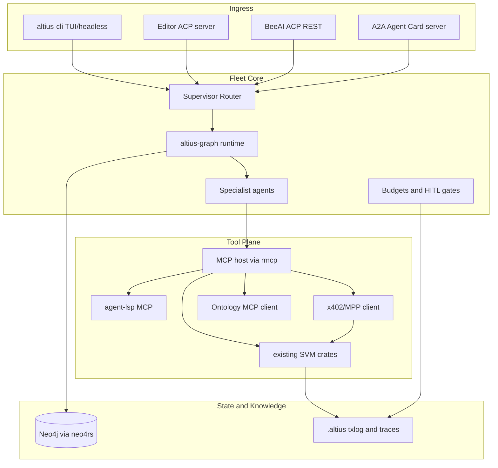

# Multi-Agent Fleet (Full Platform)

## Current baseline

Altius today is an Apache-2.0 Rust workspace with Solana Phase-0 tooling only:

- [`crates/altius-svm-detect`](crates/altius-svm-detect) — project/framework detection
- [`crates/altius-svm-tools`](crates/altius-svm-tools) — build/test/lint/deploy plans (never submits txs)
- [`crates/altius-txguard`](crates/altius-txguard) — mandatory policy → simulate → diff → approve → audit → sign
- [`crates/altius-signer`](crates/altius-signer) — isolated signer IPC (`Pubkey` / `Sign` only)
- [`crates/altius-cli`](crates/altius-cli) — `altius detect|deploy`

There is no agent runtime, MCP host, editor protocol, or memory layer yet. README already promises TUI / headless / editor ACP; moat docs already call for orchestration + x402 payments.

## Critical naming / trust boundaries

- **Editor ACP** = [Agent Client Protocol](https://agentclientprotocol.com) (editor ↔ agent). Keep this name for Altius UX.
- **BeeAI ACP** = [Agent Communication Protocol](https://agentcommunicationprotocol.dev) (agent ↔ agent REST runs). Implement under `altius-beeacp` or `altius-acp-comm` to avoid collision.
- **MCP** = tools/resources/prompts for agents ([2025-11-25 spec](https://modelcontextprotocol.io/specification/2025-11-25)); use official Rust SDK `rmcp`.
- **A2A** = opaque agent interoperability ([a2aproject/A2A](https://github.com/a2aproject/A2A), Rust via `a2a-rs`).
- **ANP** = identity/discovery/DID (`did:wba`), description, messaging ([AgentNetworkProtocol](https://github.com/agent-network-protocol/AgentNetworkProtocol)).
- **CL4R1T4S** = untrusted adversarial corpus. Do **not** copy leaked system prompts. Optional later use: red-team fixtures only inside `altius-eval`.
- **Ontology WASM CDT** = Ontology *blockchain* contracts, not OWL. Treat as a specialist WASM contract toolchain, separate from [`open-ontologies`](https://github.com/fabio-rovai/open-ontologies) (RDF/OWL MCP engine).

## Target architecture

### Default topology

Supervisor + specialists (not fully peer-to-peer for v1):

| Agent | Responsibility | Dangerous tools |
|---|---|---|
| `router` | Decompose task, route, merge, enforce budgets | none |
| `explorer` | Codebase search, agent-lsp intelligence | read-only |
| `coder` | Edits, builds, tests via SVM tools | write files; no signing |
| `security` | Lint/audit review, policy critique | read-only |
| `deployer` | Produce `TxRequest`s only | must call TxGuard |
| `payment` | x402/MPP paid API calls | must call TxGuard (`TxKind::Payment`) |
| `knowledge` | Neo4j + ontology MCP queries | write graph with schema gates |
| `critic` | Trajectory QA before finalize | none |

All irreversible on-chain / payment actions stay behind existing [`TxGuard::submit`](crates/altius-txguard/src/pipeline.rs) and [`altius-signer`](crates/altius-signer/src/protocol.rs).

## New crate boundaries

Add under [`crates/`](crates/) without rewriting current SVM crates:

1. **`altius-core`** — shared IDs, budgets, errors, redaction, correlation IDs
2. **`altius-graph`** — own Tokio graph runtime (LangGraph-inspired patterns from [rust-langgraph](https://github.com/kareem2002-k/rust-langgraph); do not hard-depend on the immature crate). Nodes, edges, checkpoints, fan-out/fan-in, interrupts for HITL
3. **`altius-agents`** — role implementations + prompt/policy packs (Altius-authored, not leaked prompts)
4. **`altius-mcp`** — MCP host/client using `rmcp`; expose Altius tools; attach external MCP (agent-lsp, open-ontologies)
5. **`altius-protocol`** — BeeAI ACP run lifecycle + A2A agent-card/task adapters + ANP discovery/identity stubs
6. **`altius-memory`** — Neo4j store (`neo4rs`): workflow checkpoints, procedural memory, code/entity graph
7. **`altius-payments`** — x402/MPP challenge handling; constructs `TxRequest` with new `TxKind::Payment`; never holds keys
8. **`altius-ontology`** — thin client/adapter for OWL/RDF ontology MCP + Altius domain schema loader
9. **`altius-wasm-agents`** — sandbox/runner for WASM specialists; later Ontology chain CDT tooling
10. Extend **`altius-cli`** — `altius fleet run|serve|mcp|acp|a2a` commands
11. Extend **`altius-txguard`** — `TxKind::Payment`, richer `DiffReport` program labels (already suggested in moat addendum)

Keep dependency direction acyclic: `cli → agents/protocol → graph/mcp/memory/payments → core/txguard/svm-*`.

## Implementation phases

### Phase A — Fleet MVP (local, testable)

- `altius-core` + `altius-graph` with in-memory checkpointing and Neo4j checkpoint adapter behind a trait
- Supervisor graph: router → explorer/coder → critic → finalize
- Provider-neutral LLM trait + one OpenAI-compatible adapter
- MCP stdio server exposing detect/build/test/lint (wrapping existing crates)
- CLI: `altius fleet run --prompt "..."` headless
- Unit + graph golden-path tests; CI keeps `cargo test`

### Phase B — Protocol surfaces

- BeeAI ACP: agent manifest, `/runs` create/get/cancel/resume (`created|in-progress|awaiting|completed|failed|cancelled`)
- Editor ACP endpoint (separate module) for IDE embedding
- MCP streamable HTTP + stdio; wire [agent-lsp](https://www.agent-lsp.com) as optional external MCP
- A2A agent card + task delegation client/server using `a2a-rs` where stable
- ANP: publish agent description + local discovery; DID `did:wba` verify-path stub first

### Phase C — Payments + trust moat

- Add `TxKind::Payment` to [`tx_request.rs`](crates/altius-txguard/src/tx_request.rs); irreversible + policy-gated
- `altius-payments`: parse x402/MPP 402 challenges, build payment tx, route through TxGuard, retry HTTP with proof
- Align with Solana Foundation [pay](https://github.com/solana-foundation/pay) / [x402](https://github.com/solana-foundation/x402) flows; biometric wallet UX stays outside the model (signer process)
- Headless mode remains fail-closed without approval channel

### Phase D — Knowledge + ontology + WASM

- Neo4j schema: `Agent`, `Run`, `Step`, `Artifact`, `Contract`, `Vulnerability`, `Skill`, relationships for call/deploy/pay
- `altius-ontology` integrates open-ontologies-style MCP tools for domain schemas (SVM/security ontology subset)
- `altius-wasm-agents`: capability-limited WASM worker host; Ontology WASM CDT as optional chain specialist later
- Agora concepts (schema negotiation between heterogeneous agents) as an adapter pattern over A2A/ANP, not a Python dependency

### Phase E — Hardening

- Trace spans per agent/tool with redaction (LangSmith-style trajectory logging in Neo4j + JSONL)
- Budgets: max steps, tokens, wall time, dollars, parallel workers
- Eval harness; CL4R1T4S only as adversarial prompt-injection fixtures if explicitly enabled
- Docker Compose: Neo4j + fleet server; CI matrix with Neo4j service container
- Docs: disambiguate ACP names; update [`README.md`](README.md) and add `docs/specs/FLEET_ARCHITECTURE.md`

## Persistence choice (selected)

**Neo4j** via `neo4rs` for:

- durable graph checkpoints / run DAGs
- cross-session procedural memory
- code/entity relationships for fleet routing

Caveat: `neo4rs` is community / WIP — wrap behind `MemoryStore` trait with an in-memory fallback for unit tests and offline CI.

## Security invariants (non-negotiable)

- No private keys in model context; signer API stays `Pubkey`/`Sign` only
- No path to broadcast without `TxGuard::submit`
- MCP/A2A/ANP remote inputs treated as untrusted (injection-aware tool results)
- Payment and mainnet actions require HITL; headless defaults deny
- Secrets redacted from Neo4j traces and MCP responses

## Out of scope for first merge train

- Replacing existing detect/deploy CLI behavior
- Shipping a full TUI in the same PR as the fleet core
- Full ANP meta-protocol / Agora production mesh
- Copying third-party leaked system prompts
- Building Neo4j database engine itself (use Neo4j as dependency/service)

## Validation

- `cargo test` for graph, protocol codecs, payment challenge parsing, memory trait
- Integration: fleet run that detects fixture Anchor project, builds via tools, refuses unsigned deploy bypass
- Optional Neo4j docker job for checkpoint resume
- Mutation-style test: assert no code path signs without TxGuard stages
