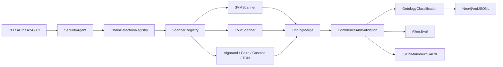

# Multi-Chain Security Fleet

## Architecture

Dependency direction: `cli/agents → security/eval → findings/detect/chain-tools → core`; persistence consumes shared finding types, and scanners never depend on TxGuard or signer.

## Phase 1: Canonical security foundation

- Add `crates/altius-findings` as a dependency-light shared model: `Finding`, `ScanReport`, `ChainFamily`, severity, confidence, source/provenance, location/span, stable fingerprint, validation state, and remediation references.
- Preserve compatibility by converting existing [`LintFinding`](crates/altius-svm-tools/src/report.rs) into the canonical type; remove ad-hoc duplicate DTO shaping from [`altius-mcp/src/server.rs`](crates/altius-mcp/src/server.rs) and [`altius-agents/src/tools.rs`](crates/altius-agents/src/tools.rs).
- Add `crates/altius-detect` with a read-only plugin registry and ranked `DetectedProject` results. Keep [`altius-svm-detect`](crates/altius-svm-detect) as the first adapter and retain current Anchor/Pinocchio/native behavior.
- Add unit tests for serialization, fingerprint stability, dedupe, path normalization, plugin conflicts, and backward-compatible SVM output.

## Phase 2: Activate the security fleet route

- Replace `SECURITY_STUB_SYSTEM` in [`crates/altius-agents/src/prompts.rs`](crates/altius-agents/src/prompts.rs) with a strict read-only audit policy and add `security` to router output.
- Extend [`crates/altius-agents/src/supervisor.rs`](crates/altius-agents/src/supervisor.rs) with `FleetRoute::Security`, `security_notes`, forced `agent_name=security` / `@Security`, a security node, and critic/finalizer flow.
- Add `security_tools()` and a bounded dispatcher in [`crates/altius-agents/src/tools.rs`](crates/altius-agents/src/tools.rs); start with project detection and native SVM scanning only.
- Promote `AgentRole::Security` out of `stub_roles()` in [`roles.rs`](crates/altius-agents/src/roles.rs), update deterministic offline behavior, BeeAI routing, A2A card skills, CLI forcing, and route tests.

## Phase 3: Deep Solana implementation

- Refactor [`crates/altius-svm-tools/src/lints/rules.rs`](crates/altius-svm-tools/src/lints/rules.rs) from whole-file presence checks toward function/account-context analysis while keeping rule IDs stable.
- Extend Altius-owned rules using public security knowledge from Neodyme/solsec: canonical PDA bump, sysvar/instruction-introspection validation, account confusion, unchecked accounts, unsafe arithmetic/rounding, CPI target validation, close/revival, and oracle guardrails.
- Add framework-aware Anchor/native/Pinocchio handling, exact line/span evidence, attack preconditions, and remediation mappings to native checks, Vipers-style validation, or checked arithmetic—without importing those repositories.
- Add `clippy` and `cargo-audit` adapters as explicitly invoked local scanners with bounded output and unavailable-tool results rather than silent success.
- Introduce a feature-gated dynamic scanner interface. Implement an Altius-owned stateful sequence/invariant harness on local SVM first; permit optional interoperability with an installed Trident executable later, but never vendor Trident/trident-svm or execute against mainnet.
- Add an authorized local-only PoC verification state (`Unverified → ReproducedLocal → Rejected`) with no remote/mainnet path.

## Phase 4: Ontology and durable security memory

- Expand [`crates/altius-ontology/src/schema.rs`](crates/altius-ontology/src/schema.rs) to chain-neutral vulnerability roots and chain-specific subclasses; map every native rule ID to an ontology class.
- Extend [`KnowledgeStore`](crates/altius-memory/src/store.rs) and [`Neo4jKnowledgeStore`](crates/altius-memory/src/neo4j.rs) with Contract/Target, Vulnerability, Evidence, Scanner, and Skill records plus `HAS_VULNERABILITY`, `DETECTED_BY`, and `MITIGATED_BY` relations.
- Persist redacted scan trajectories using [`trajectory.rs`](crates/altius-memory/src/trajectory.rs); keep JSON/in-memory operation first-class and Neo4j optional.
- Implement deterministic dedupe and multi-source confidence aggregation. LLM critics rank or challenge candidates but never serve as the sole evidence source.

## Phase 5: Native multi-chain scanner plugins

- Add source-owned scanner modules behind a common `Scanner` trait, each returning canonical findings:
  - EVM/Solidity: Foundry/Hardhat detection; Wake-inspired static/fuzz workflow, arithmetic, access control, reentrancy, call/delegatecall, oracle and invariant checks.
  - Algorand: TEAL/PyTeal transaction-field, group, rekey/close, asset and state checks.
  - Cairo/Starknet: felt arithmetic, access control, L1 handler sender, address conversion and replay checks.
  - Cosmos/CosmWasm: SDK-version-aware consensus-path analysis, determinism, panic/state divergence, IBC and bookkeeping checks.
  - TON: FunC/Tact sender, Jetton notification, boolean, replay and gas-forwarding checks.
- Keep each plugin isolated and feature-gated so default CI remains offline and fast. External tools such as Wake, Tealer, Caracal, or Trident are optional executables behind adapters—not source dependencies and not required for native coverage.
- Add chain-specific fixture corpora with positive and negative cases and full pattern-accounting tests.

## Phase 6: Altius evaluation moat

- Add `crates/altius-eval` with Altius-owned fixtures, structured gold labels, frozen prompts/options, budgets, deterministic offline runs, and JSON/Markdown score reports.
- Implement Arena-style Critical/High `x/y` recall plus precision, false-positive rate, duplicate rate, evidence quality, latency, and cost. Treat public Trident/Wake Arena results as methodology/reference only.
- Store source URL, commit hash, license/SPDX, label author, and review date in `PROVENANCE.md`; do not copy private detectors, leaked prompts, proprietary reports, or unlicensed benchmark repositories.
- Start with SVM detect/lint/guardrail fixtures, then add EVM and remaining chains. Put heavy/fuzz/model suites behind nightly or manual CI.

## Phase 7: Product and CI surfaces

- Add `altius scan --path ... --chain auto --format json|markdown|sarif` and `altius eval run`; expose the same read-only operations via MCP, BeeAI `agent_name=security`, and A2A skills.
- Add PR-diff scanning and SARIF output; fail CI only on configurable severity/confidence thresholds and always preserve evidence.
- Extend the PWA only after report APIs are stable: findings list, source evidence, confidence/validation state, and HITL approval for remediation—not deployment.
- Keep enterprise infrastructure scanning (Nessus/Qualys/CISA KEV/SIEM/SLA) as a separate `scan-infra` track sharing report concepts but not smart-contract severity or execution paths.

## Provenance and safety gates

- Every borrowed idea receives a source citation and independent Altius implementation note; no repository vendoring, source copying, trademark implication, or hidden network download.
- Default scan path is static/read-only. Dynamic tests are local sandbox only, bounded by time/memory/input limits, and never receive signer access.
- Remediation generation is separate from scanning; any eventual deploy/payment remains behind TxGuard and explicit human approval.
- Each phase must pass `cargo fmt`, workspace tests, feature-specific tests, lint regression fixtures, and unchanged guardrail tests before the next phase begins.