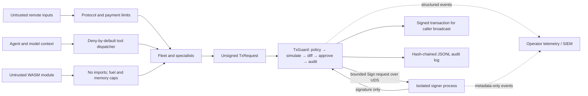

# Security threat model and trust boundaries

Status: living security document. It describes the controls implemented in
this repository and the deployment assumptions those controls still require.

## Security goals

- Keep private signing keys outside agent/model/tool processes.
- Route every supported irreversible on-chain action through one policy,
  simulation, approval, audit, and signing choke point.
- Treat protocol, tool, browser, payment-challenge, and WASM inputs as
  untrusted.
- Fail closed when a capability, approval, identity check, or input bound is
  absent.
- Produce useful security telemetry without recording raw messages, signed
  transaction bytes, secrets, or key material.

Availability of remote services and correctness of third-party RPC state are
important operational concerns, but they are not guaranteed by these crates.

## Architecture and boundaries

### Signer isolation

`altius-signer` exposes only `Pubkey` and `Sign` over a Unix-domain socket
(UDS). Key loading and signing occur in the signer process; TxGuard sends the
serialized message and receives a public key or signature. Signer tracing
records operation names, message lengths, and outcomes, never message bytes,
signatures, or key material.

The process boundary reduces accidental key exposure; it is not a hardware
security boundary. A host administrator, debugger, compromised signer process,
or process with access to the keypair file can still obtain or misuse the key.
Production deployments should use a dedicated OS identity, a private
owner-only socket directory, restrictive key-file permissions, and preferably
a hardware/KMS backend when one is implemented.

The server sets the socket to owner-only mode (`0600`) before accepting
connections, and the file backend refuses keypair files with any group or
other permissions. It does not authenticate peer credentials, so all
processes running as the signer OS user remain inside the trust boundary.
Use a dedicated OS identity and do not place the socket in an unprotected
shared directory.

### TxGuard as the signing choke point

The supported transaction path is `TxGuard::submit`: policy, mandatory
simulation, simulation-derived diff, approval, audit append, then signer IPC.
Payments call `settle_via_guard`; tool adapters block known direct deployment
shortcuts. Mainnet always requires approval or is forbidden, and configured
lamport caps reject oversized transfers and payments.

This is a codebase invariant, not a claim that the operating system prevents
all other software from talking to the signer socket. Protecting the UDS is
required to make the choke point effective. New transaction producers must
depend on TxGuard rather than `altius-signer`.

### Tools and WASM

Local agent tools pass through deny-by-default role permissions and project
allowlists. Missing permission does not widen access. Browser/MCP responses
remain untrusted input and have no direct signer path.

WASM modules are validated and registered with explicit capabilities. Runtime
execution provides no WASI or host imports, enforces fuel and linear-memory
limits, and has no signing capability. Capability flags for future file/network
host functions do not currently grant imports.

### Protocol and persistence boundaries

HTTP bodies, JSON-RPC messages, identifiers, lists, opaque JSON, and x402
challenges have explicit bounds before use or forwarding. Bounds limit resource
abuse; they do not establish authenticity or semantic correctness.

Fleet HTTP services default to loopback. A non-loopback bind is rejected unless
a bearer token is configured, and that token gates all merged BeeAI ACP, A2A,
ANP, and PWA routes. URL query authentication is accepted only by the SSE events
route because browser `EventSource` cannot set request headers. TLS and token
rotation remain deployment responsibilities; terminate TLS at a trusted reverse
proxy and avoid putting tokens in persistent URLs or logs.

#### Remote fleet (`altius fleet serve`)

When the HTTP listener binds to anything other than a loopback address, startup
**fails closed** unless `--token` or `ALTIUS_FLEET_TOKEN` is set. Treat the
token like a session secret (equivalent to Claude Code Remote Control session
URLs): rotate on compromise, prefer TLS termination in front of the bind, and
never commit tokens to the repository.

- **Loopback demos:** `127.0.0.1:8788` (default) may run without a token for
  offline development; all other routes still honor policy/simulation/HITL inside
  the supervisor.
- **Remote clients:** send `Authorization: Bearer <token>` on REST calls.
  For SSE (`EventSource`), append `?token=<token>` only on `/runs/{id}/events`
  (EventSource cannot set headers; query tokens are rejected elsewhere).
- **Probes:** `GET /health` and `GET /ready` stay unauthenticated so load
  balancers and orchestrators can check liveness without exposing run APIs.

**Graph checkpoint durability (known limitation):** BeeAI ACP runs persist in
SQLite (`SqliteRunStore`, default `~/.altius/runs.db`), but supervisor graph
checkpoints in `altius fleet serve` are held in a process-lifetime
`InMemoryCheckpointer` (`serve_command.rs`). HITL `awaiting` → `resume` works
within a single process; after restart, the BeeAI run row may still show
`awaiting`, but resume falls back to a full supervisor re-run with the resume
message appended (no node-level checkpoint restore). Durable checkpoint storage
exists only via `MemoryStoreCheckpointer` + `Neo4jMemoryStore` (feature
`neo4j`, external Neo4j); there is no SQLite/file checkpoint adapter today.
Operators should treat restart during `awaiting` as best-effort recovery, not
exact graph replay.

The TxGuard audit log is hash-chained and detects modification during explicit
verification. It is not an append-only remote ledger: a local attacker able to
replace the entire file can rebuild a valid chain. Ship logs to protected
remote storage for stronger evidence. Agent trajectory persistence uses secret
redaction, but operators must still avoid feeding confidential payloads into
unnecessary protocol fields.

## Simulation-to-sign limitations

Simulation is evidence about one observed state, not a lock on future chain
state:

- **State drift:** balances, account data, authorities, or program state may
  change after simulation and before execution. A transaction can fail or have
  effects that differ from the displayed simulation.
- **Blockhash expiry:** a signed transaction becomes invalid after its recent
  blockhash ages out. TxGuard does not refresh a blockhash after approval,
  because doing so would change the signed message.
- **Replay and duplicate submission:** TxGuard returns signed bytes to its
  caller and does not own broadcast deduplication or confirmation tracking.
  Solana normally deduplicates an identical signature while its blockhash is
  valid, but callers must not treat retries or newly signed equivalent
  messages as inherently idempotent.
- **RPC trust:** simulation and later broadcast may observe different nodes or
  commitment levels. A malicious or stale RPC can provide misleading results.

The RPC simulator submits the same unsigned instructions/account keys but uses
`replaceRecentBlockhash: true`; therefore the node may simulate with a
replacement blockhash rather than the blockhash later signed. Current
mitigations are mandatory human approval for high-risk paths, a tamper-evident
decision record, hard outflow caps, and no automatic blockhash refresh/re-sign
in TxGuard. Operational mitigations should include a short simulate-to-submit
window, trusted RPC endpoints, explicit commitment policy,
confirmation/status checks, idempotency keys in higher-level workflows, and
re-simulation plus renewed approval whenever the message or blockhash changes.
Durable nonce/replay tracking and atomic state-version preconditions are not
implemented.

## Monitoring and incident response

TxGuard emits structured stage/outcome events inside a `txguard.submit` span.
Signer client/server IPC emits operation metadata and failures without payload
contents. Applications must install a tracing subscriber/exporter; the library
does not choose a telemetry backend.

Recommended alerts:

- policy, simulation, or approval rejection spikes;
- signer connection failures or unexpected request volume;
- audit-chain verification failure or missing expected audit entries;
- repeated blockhash-expired submissions and confirmation timeouts;
- any direct signer-socket client outside the approved TxGuard service identity.

For an incident: stop the signer, revoke socket access, protect and copy audit
and telemetry data, verify the audit chain, inventory recent signatures and
on-chain status, rotate exposed keys, and only resume after the unauthorized
path is removed. Never attach raw keypair files or signed transaction payloads
to tickets or public logs.

## Concrete user stories

1. **Deploy a program:** a deployer builds an unsigned `TxRequest`; TxGuard
   checks cluster policy, simulates, presents the diff, records approval, and
   requests the isolated signer. Any failed stage returns without signing.
2. **Pay for an API:** the payment adapter validates and selects a bounded x402
   requirement, builds a capped native-SOL transfer, and obtains proof only from
   a signed `TxGuard` outcome. Headless fail-closed approval produces no proof.
3. **Run a specialist:** an operator registers a WASM module with minimal
   capabilities. The module runs with no imports and cannot reach TxGuard or
   the signer.
4. **Investigate a denial:** an operator correlates the TxGuard span with its
   audit entry, checks policy/simulation/approval outcomes, and avoids collecting
   the raw message or transaction bytes.
5. **Respond to suspected signer misuse:** an operator stops the daemon,
   restricts the UDS, compares signer operation telemetry with TxGuard/audit
   records, checks on-chain signatures, and rotates the key if compromise
   cannot be excluded.

## Glossary

- **Approval channel:** human or fail-closed component that decides whether an
  already simulated transaction may proceed.
- **Choke point:** the single supported route through which a sensitive
  operation must pass.
- **Deny by default:** access is refused unless an explicit grant exists.
- **Guest ABI:** the bounded `alloc`/`run` memory contract between a WASM module
  and its host.
- **Recent blockhash:** Solana transaction freshness value with a limited
  validity window.
- **Replay:** submitting the same signed transaction, or re-signing an
  equivalent action, more than once.
- **State drift:** chain state changing between simulation and execution.
- **TxGuard:** the policy/simulation/diff/approval/audit/sign orchestration
  boundary.
- **UDS:** Unix-domain socket used for local signer IPC.
