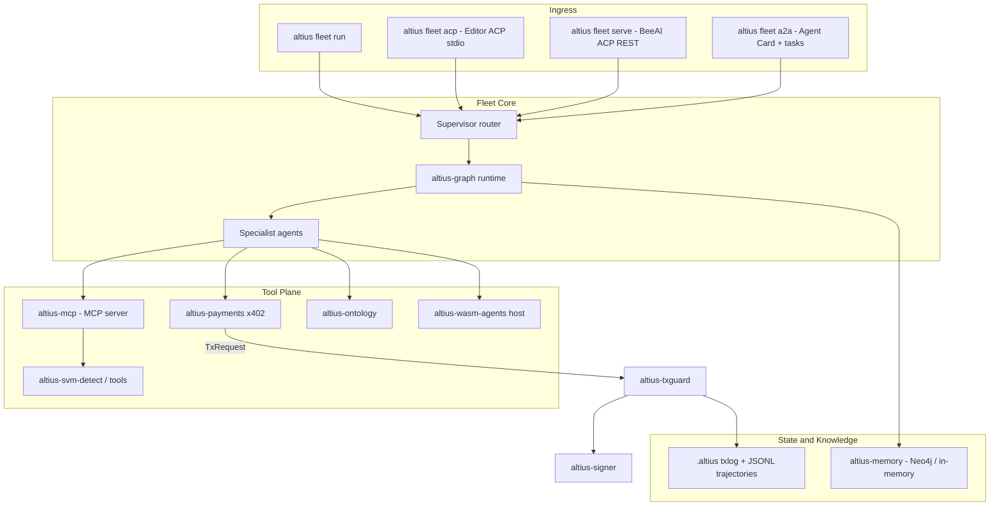

# Altius Multi-Agent Fleet Architecture

Status: living document. Covers the fleet crates layered on top of the
Phase-0 SVM tooling described in
[`FASE-0_SVM_INTEGRATION_SPEC.md`](../FASE-0_SVM_INTEGRATION_SPEC.md).

## 1. Overview

The fleet is a supervisor + specialists topology running on an Altius-owned
Tokio graph runtime. Multiple protocol surfaces feed the same supervisor;
all tools flow through a controlled tool plane; all irreversible on-chain
actions (deploys, transfers, x402 payments) flow through the mandatory
TxGuard pipeline and the isolated signer.



## 2. Protocol naming (critical)

Two unrelated protocols share the "ACP" acronym; this repo never uses the
bare acronym in code:

- **Editor ACP** — the [Agent Client Protocol](https://agentclientprotocol.com)
  (editor ↔ agent). Implemented in `altius-protocol::editor_acp` as a typed
  JSON-RPC codec (`initialize`, `session/new`, `session/prompt`,
  `session/cancel`) and served by `altius fleet acp` over stdio.
- **BeeAI ACP** — the [Agent Communication Protocol](https://agentcommunicationprotocol.dev)
  (agent ↔ agent). Implemented in `altius-protocol::beeacp` as the REST run
  lifecycle (`created | in-progress | awaiting | completed | failed |
  cancelled`) and served by `altius fleet serve` at `/runs`.
- **MCP** — the [Model Context Protocol](https://modelcontextprotocol.io):
  tools/resources for agents. `altius-mcp` exposes the safe SVM tools
  (detect/build/test/lint) over stdio or HTTP via `altius fleet mcp`.
- **A2A** — [Agent2Agent](https://github.com/a2aproject/A2A): opaque agent
  interoperability. `altius-protocol::a2a` publishes the agent card at
  `/.well-known/agent-card.json` plus a task endpoint (`altius fleet a2a`,
  also merged into `fleet serve`).
- **ANP** — [Agent Network Protocol](https://github.com/agent-network-protocol/AgentNetworkProtocol):
  identity/discovery. `altius-protocol::anp` carries description/discovery
  stubs; `did:wba` verification is future work.

### 2.1 BeeACP wire protocol (fleet serve)

Machine-readable contract: **OpenAPI 3.1** at `GET /openapi.json` (public,
no auth). Probes: `GET /health`, `GET /ready`.

| Route | Method | Purpose |
|---|---|---|
| `/runs` | `GET` | List runs (newest first) |
| `/runs` | `POST` | Create run (`agent_name`, `input[]`) → `202`, status `in-progress` |
| `/runs/{id}` | `GET` | Run snapshot; includes `approval` when `awaiting` |
| `/runs/{id}` | `POST` | Resume awaiting run (`message?`, `decision?`) → `202` |
| `/runs/{id}/cancel` | `POST` | Cancel non-terminal run |
| `/runs/{id}/events` | `GET` | SSE: `event: run` + JSON [`Run`] body on change |

**Auth:** when `--token` / `ALTIUS_FLEET_TOKEN` is set, all `/runs*` routes
require `Authorization: Bearer <token>`. SSE clients without header support
may pass `?token=` on `/runs/{id}/events` only.

**Lifecycle:** strict transitions per `RunStatus::can_transition_to` (see
`altius-protocol::beeacp::model`). Human-in-the-loop pauses set
`status = awaiting` and attach a typed **`approval`** object on the run
snapshot (not a session/message bus):

```json
{
  "summary": "human-readable headline",
  "reason": "optional longer text",
  "node": "graph node that interrupted",
  "kind": "generic | transaction",
  "transaction": {
    "action_summary": "Transfer 500000000 lamports",
    "lamport_deltas": [{ "account": "…", "delta_lamports": "-500000000" }],
    "invoked_programs": ["11111111111111111111111111111111"]
  }
}
```

Resume with `POST /runs/{id}` and `{ "decision": { "approved": true, "note": "…" } }`
and/or a `message`. `{ "approved": false }` cancels the run. PWA client:
`assets/pwa/beeacp-client.js` (hand-typed, zero build).

**Intentionally absent** (generalist agent SDK scope): sessions, message
history, fork/revert/todo, `prompt_async`, TUI bridge, structured-output
`json_schema`.

One more disambiguation: `altius-ontology` is about OWL/RDF-style *domain
schemas* (SVM security concepts), not the Ontology blockchain. Ontology-chain
WASM CDT tooling would live as an optional specialist on `altius-wasm-agents`.

## 3. Crate map

| Crate | Layer | Role |
|---|---|---|
| `altius-core` | shared | IDs (`RunId`, `StepId`, …), budgets, redaction |
| `altius-graph` | fleet core | Tokio graph runtime: nodes, edges, checkpoints, fan-out/fan-in, HITL interrupts; `MemoryStore` trait |
| `altius-agents` | fleet core | Role prompt/policy packs + supervisor graph (router → explorer/coder → critic → finalize) |
| `altius-mcp` | tool plane | MCP server wrapping detect/build/test/lint; optional MCP client multi-attach (`mcp-client`) over stdio or authenticated streamable HTTP (browser / GitHub / agent-lsp) |
| `altius-protocol` | ingress | Editor ACP codec, BeeAI ACP runs, A2A card/tasks, ANP stubs, shared input limits |
| `altius-payments` | tool plane | x402 402-challenge parsing → `TxKind::Payment` `TxRequest` → settlement **only** via `TxGuard::submit` → `X-PAYMENT` proof header |
| `altius-memory` | state | Neo4j knowledge graph (feature `neo4j`) + in-memory fallback; redacted JSONL trajectory logging |
| `altius-ontology` | knowledge | Built-in SVM/security domain schema + `StaticOntologyClient`; MCP-backed `McpOntologyClient` (feature `mcp`) for external OWL/RDF servers |
| `altius-wasm-agents` | tool plane | Capability-limited WASM host (deny-by-default); fuel/memory-metered execution behind feature `wasmtime` |
| `altius-txguard` | guardrail | Policy → simulate → diff → approve → audit → sign; `TxKind::Payment` is irreversible and approval-gated by default |
| `altius-signer` | guardrail | Isolated signer process, `Pubkey`/`Sign` only |
| `altius-cli` | ingress | `altius detect | deploy | fleet run|serve|mcp|acp|a2a`; serves PWA at `/app/` |

Dependency direction stays acyclic:
`cli → agents/protocol → graph/mcp/memory/payments → core/txguard/svm-*`.

## 4. Agent topology

| Agent | Responsibility | Dangerous tools |
|---|---|---|
| `router` | Decompose, route, merge, enforce budgets | none |
| `explorer` | Codebase search / intelligence | read-only (`detect_project`, `lint_project`, `read_file`, `grep`, `glob`) |
| `coder` | Edits, builds, tests | `write_file` / `edit_file` / allowlisted `run_command`; no signing |
| `browser` | Web automation via attached browser MCP | read/interact only; `browser_*` tool allowlist; no TxGuard path |
| `github` | Repository, issue, checks, and pull-request operations via GitHub MCP | read-only by default; explicit branch/file/PR allowlist in `pull-requests` mode; merge/delete/admin/workflow dispatch denied |
| `security` | Cross-file scan correlation, exploit reasoning, and scanner triage | read-only (`detect_project`, `lint_project`, `scan_project`, `triage_project`, FS reads/search); no shell/signing |
| `deployer` | Produces `TxRequest`s only | must call TxGuard |
| `payment` | x402 paid API calls | must call TxGuard (`TxKind::Payment`) |
| `knowledge` | Neo4j + ontology queries | schema-gated graph writes |
| `critic` | Trajectory QA before finalize | none |

Router, explorer, coder, browser, GitHub, security, and critic are live graph
nodes.
Before the router model runs, an offline deterministic classifier emits a
serialized `RouteDecision` (`intent`, `risk`, explicit `signals`, `reason`).
Forced `agent_name`, `@Mention`, and slash-skill routes have highest priority;
otherwise security/on-chain risk, browser URL interaction, GitHub resources,
edit/build side effects, and read-only investigation are evaluated in that
order. Ambiguous tasks fail toward the least-privilege explorer. The router
model still plans, but cannot silently override this auditable decision.
Explorer/coder/security run a bounded `tool_loop` (up to 12 rounds) through
`HookedDispatcher` → `PermissionedDispatcher` → `LocalTools`. Project
instructions load from `.altius.md` or `ALTIUS.md` at the project root
(optional `[project_path=…]` marker) and inject into specialist system
prompts after secret redaction. Optional `[tools]` in `altius.toml`
tunes write/bash allowlists without touching TxGuard `[svm.policy]`:

```toml
[tools]
allow_write = true
allow_bash = true
# bash_allowlist = ["cargo", "anchor", "forge"]
# deny_tools = ["run_command"]
```

Each tool result also produces a bounded `EvidenceEntry`: stable per-run ID,
tool name, success/failure status, compact SHA-256 digest, redacted excerpt,
and finding/file references. Critic/finalize prompts require `[E…]` citations
for scan/build/test/simulation claims. A deterministic finalize post-check
adds an explicit unverified warning when no matching successful tool evidence
exists.

When a `MemoryStore` is attached (the durable SQLite store in `fleet serve`),
the supervisor persists bounded, redacted failure/decision/success learning
records in a project-scoped KV namespace. At most 64 records are retained;
up to six relevant records / 4 KiB are recalled. Recalled text is labeled
**untrusted historical memory** and must be re-verified. Probable private keys
are rejected and credentials are redacted before persistence.
`fleet run` uses `<project>/.altius/fleet-memory.db` by default; set
`ALTIUS_MEMORY_DB` to choose another SQLite path.

Inference is provider-neutral and policy-wrapped per task class. Capability
preference controls ordering, while timeout, retry/backoff, fallback, and a
fail-closed estimated-token budget apply to every call. Existing
OpenAI-compatible configuration remains valid; optional knobs are:

- `ALTIUS_LLM_FALLBACK_MODELS` — comma-separated model fallback chain
- `ALTIUS_LLM_TIMEOUT_MS` — per-attempt timeout (default 120000)
- `ALTIUS_LLM_MAX_RETRIES` — bounded retries per provider (default 2)
- `ALTIUS_LLM_BACKOFF_MS` — exponential-backoff base (default 250)
- `ALTIUS_LLM_TOKEN_BUDGET` — estimated per-specialist budget (default 64000)
- `ALTIUS_LLM_COST_BUDGET_MICROUSD` — optional estimated cost ceiling
- `ALTIUS_LLM_COST_PER_1K_TOKENS_MICROUSD` — deployment-specific cost estimate

The browser node uses an optional external MCP attachment (e.g. Playwright)
when `agent_name=browser` or the prompt contains `@Browser`, still wrapped
with the same hook plane. Deployer, payment, and knowledge have
prompt/policy packs and backing crates but their graph-node wiring is still
pending (see `stub_roles()` in `altius-agents`).

Browser MCP attach is opt-in at `altius fleet serve` via
`--browser-mcp-cmd` / `ALTIUS_BROWSER_MCP_CMD` (args:
`--browser-mcp-args` or `ALTIUS_BROWSER_MCP_ARGS` as a JSON array). A
zero-build PWA thin client is served at `/app/` for dispatch, run list,
and awaiting-approval resume.

GitHub MCP attach is opt-in for `fleet run` and `fleet serve` via
`--github-mcp-url` / `ALTIUS_GITHUB_MCP_URL`. Authentication is read from
the environment variable named by `--github-token-env` (default
`GITHUB_TOKEN`); the token value is never accepted on the command line,
serialized, logged, persisted, or placed in model context. The default
`--github-access read-only` exposes only inspection tools. Explicit
`--github-access pull-requests` additionally permits a bounded set of
branch/file-write and pull-request create/update tools while continuing to
deny merge, delete, release, workflow-dispatch, and repository-admin tools.
Route with `agent_name=github`, `/github`, or `@GitHub`.

### 4.1 Security specialist

The Security route scans the complete project before reading supporting code.
`triage_project` returns full canonical findings, deterministic disposition
hints, repeated-pattern and compound-attack hypotheses, exploit-verification
steps, and the related files that need inspection. The model must then inspect
callers, account definitions, validation helpers, and sensitive sinks before
classifying each candidate as `true_positive_likely`,
`false_positive_likely`, or `needs_review`.

Security output has explicit findings, triage, cross-file correlations, exploit
rationale, confidence/limitations, and recommendations sections. Scanner
matches remain candidates rather than proof. Project-local tool configuration
may tighten this node but cannot enable writes or shell commands; dynamic PoC
claims require an explicit local validation result. No security tool has a
signing or TxGuard path.

### 4.2 Offline security evaluation

`altius-eval` ships small Altius-owned SVM fixtures with vulnerable cross-file
and checked-clean projects. The deterministic native-scanner run measures
precision, recall, Critical/High recall, false-positive rate, tool success
rate, and elapsed latency. Token and provider-cost fields are nullable because
the default run invokes no LLM; a future opt-in live evaluator can populate
them without changing the report schema.

Run the built-in suite from any working directory:

```bash
RUSTUP_TOOLCHAIN=stable cargo run -p altius-cli -- eval
RUSTUP_TOOLCHAIN=stable cargo run -p altius-cli -- eval --markdown
```

Use `--suite path/to/gold.json --fixtures path/to/root` for another
provenance-controlled corpus.

## 5. Payments (x402) flow

1. An agent's HTTP call returns `402 Payment Required` with an x402 JSON
   challenge (`x402Version`, `accepts[]`).
2. `altius_payments::PaymentChallenge::parse` validates it as untrusted
   input; `select_solana_requirement` picks an `exact`-scheme, known-network,
   native-SOL requirement (SPL assets are rejected for now).
3. `build_payment_request` produces a `TxRequest` with
   `TxKind::Payment { lamports }`.
4. `settle_via_guard` submits it through `TxGuard::submit` — policy
   (`Payment` sits in the default `deny_instructions`, so approval is always
   required; `max_lamports_out` caps the amount), mandatory simulation, diff,
   approval, audit log, and only then the isolated signer.
5. The signed transaction becomes an `X-PAYMENT` proof header
   (`PaymentProof`) for the HTTP retry. Headless configurations
   (`FailClosed` / `AutoApprove`) deny payments; there is no bypass.

## 6. Knowledge and state

- **Per-run state:** `altius-graph` checkpoints typed state after each node
  (`Checkpointer`), through the `MemoryStore` trait (in-memory default;
  `SqliteMemoryStore` for fleet serve — same SQLite file as BeeAI runs;
  `Neo4jMemoryStore` behind feature `neo4j` persists
  `(:Run)-[:HAS_CHECKPOINT]->(:Checkpoint)` and `(:KvEntry)` scratch
  values with base64 payloads). **`altius fleet serve` uses
  `MemoryStoreCheckpointer` + `SqliteMemoryStore`** — checkpoints and the
  BeeAI-run → graph-run id map survive HITL resume across process restarts;
  full re-run remains the fallback when no checkpoint exists.
- **Cross-session knowledge:** `altius-memory` persists `Run`, `Step`,
  `Artifact`, `Contract`, `Vulnerability`, `Skill` nodes with `EXECUTED`,
  `HAS_STEP`, `PRODUCED`, `CALLED`, `DEPLOYED`, `PAID`,
  `HAS_VULNERABILITY`, `HAS_SKILL`, `HAS_CHECKPOINT` relationships. Schema
  statements are idempotent (`IF NOT EXISTS`) and applied at startup.
- **Ontology:** `StaticOntologyClient` serves the built-in SVM/security
  schema offline; `McpOntologyClient` (feature `mcp`) attaches to an
  external ontology MCP server over stdio and bounds-checks every response
  as untrusted input.
- **WASM specialists:** `WasmAgentHost` validates modules and enforces a
  deny-by-default capability policy. With feature `wasmtime`, `run_module`
  executes the guest ABI (`memory` + `alloc` + `run`) with fuel and linear
  memory caps and **no host imports** (no WASI, no signing).
- **Trajectories:** `JsonlTrajectoryLogger` appends redacted per-step events
  as JSONL, independent of Neo4j.
- Neo4j is always optional: feature `neo4j`, in-memory fallback for tests
  and offline CI. Locally: `docker compose up -d neo4j`, then
  `ALTIUS_NEO4J_URI=bolt://127.0.0.1:7687 cargo test -p altius-memory
  --features neo4j` (and likewise `-p altius-graph --features neo4j`).

## 7. Security invariants (non-negotiable)

The centralized
[`Security threat model and trust boundaries`](../SECURITY_THREAT_MODEL.md)
defines deployment assumptions, monitoring/incident-response guidance, and
simulation-to-sign drift, blockhash-expiry, and replay limitations.

- No private keys in model context; the signer API stays `Pubkey`/`Sign`.
- No path to broadcast without `TxGuard::submit`; `altius-payments` has no
  signer access of its own.
- All remote protocol inputs (MCP, BeeAI ACP, A2A, ANP, x402 challenges,
  ontology data) are untrusted and bounds-checked (`altius-protocol::limits`
  and per-crate validation).
- Payment and mainnet actions require human approval; headless defaults
  deny.
- Secrets are redacted (`altius_core::redact_secrets`) before anything is
  persisted to Neo4j or trajectory files.
- WASM specialists get deny-by-default capabilities and no signing
  capability exists at all.

## 8. Intentional stubs / future work

- ANP `did:wba` verification and full discovery.
- Graph-node wiring for deployer/payment/knowledge specialists.
- Host-function surface for WASM modules that need `fs_read` /
  `network` (today those capabilities are recorded but unused — guests
  get no imports).
- SPL-token x402 settlement.
- Richer skills loader (`.altius/skills` packs), context compaction, and
  a general plugin marketplace (v0 packs are install-by-path only).
- Adversarial prompt-injection evaluation fixtures remain future work and must
  be explicitly enabled (no third-party leaked prompts, ever).
- Optional Neo4j-backed `RunStore` (SQLite is the durable default today);
  push notifications beyond SSE.

### Done in this layer (no longer stubs)

- MCP client-side attach (`altius-mcp` `mcp-client` feature): multi-attach
  registry, `call_tool`, env allowlist; agent-lsp shim retained.
- `@Browser` dispatch: `FleetRoute::Browser` + browser specialist node +
  prefix-allowlisted MCP tools (`browser_*`).
- PWA thin client at `/app/` (chat / run list / approval card).
- `SqliteMemoryStore` for checkpoints + kv (fleet serve default; same `runs.db`).
- `Neo4jMemoryStore` Cypher for checkpoints + kv (feature `neo4j`).
- `McpOntologyClient` for external OWL/RDF ontology MCP servers
  (feature `mcp`), with bounded untrusted-response decoding.
- Fuel- and memory-metered WASM execution via wasmtime (feature
  `wasmtime`); guest ABI `memory` + `alloc` + `run`, no host imports.
- Harness Phase A: sandboxed FS/`run_command` tools, Pre/PostToolUse hooks,
  FailClosed `[tools]` permissions, `.altius.md` project memory.
- Remote fleet (P0): SQLite `RunStore` + checkpoint store, bearer/`?token=` auth, async
  `POST /runs` + `GET /runs/{id}/events` SSE, durable checkpoint
  awaiting→resume HITL (full re-run fallback when checkpoint missing).
- Slash skills v0: `/scan`, `/audit`, `/browser`, `/pay` force routes in
  CLI, BeeACP, and PWA.
- Plugin pack v0: JSON manifest (`examples/plugins/web3-starter.json`)
  via `fleet serve --plugin` / `ALTIUS_FLEET_PLUGIN`.
- CI scan surface: `altius scan --format sarif --fail-on-findings`
  (GitHub Actions `scan` job).
- Offline SVM evaluation harness with labeled vulnerable/clean fixtures,
  precision/recall/FPR, tool success, latency, and nullable token/cost metrics.
