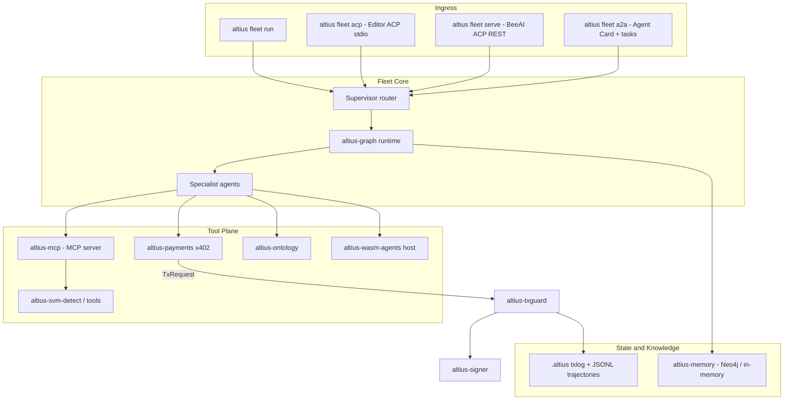

# Altius Multi-Agent Fleet Architecture

Status: living document. Covers the fleet crates layered on top of the
Phase-0 SVM tooling described in
[`FASE-0_SVM_INTEGRATION_SPEC.md`](../FASE-0_SVM_INTEGRATION_SPEC.md).

## 1. Overview

The fleet is a supervisor + specialists topology running on an Altius-owned
Tokio graph runtime. Multiple protocol surfaces feed the same supervisor;
all tools flow through a controlled tool plane; all irreversible on-chain
actions (deploys, transfers, x402 payments) flow through the mandatory
TxGuard pipeline and the isolated signer.

## 2. Protocol naming (critical)

Two unrelated protocols share the "ACP" acronym; this repo never uses the
bare acronym in code:

- **Editor ACP** — the [Agent Client Protocol](https://agentclientprotocol.com)
  (editor ↔ agent). Implemented in `altius-protocol::editor_acp` as a typed
  JSON-RPC codec (`initialize`, `session/new`, `session/prompt`,
  `session/cancel`) and served by `altius fleet acp` over stdio.
- **BeeAI ACP** — the [Agent Communication Protocol](https://agentcommunicationprotocol.dev)
  (agent ↔ agent). Implemented in `altius-protocol::beeacp` as the REST run
  lifecycle (`created | in-progress | awaiting | completed | failed |
  cancelled`) and served by `altius fleet serve` at `/runs`.
- **MCP** — the [Model Context Protocol](https://modelcontextprotocol.io):
  tools/resources for agents. `altius-mcp` exposes the safe SVM tools
  (detect/build/test/lint) over stdio or HTTP via `altius fleet mcp`.
- **A2A** — [Agent2Agent](https://github.com/a2aproject/A2A): opaque agent
  interoperability. `altius-protocol::a2a` publishes the agent card at
  `/.well-known/agent-card.json` plus a task endpoint (`altius fleet a2a`,
  also merged into `fleet serve`).
- **ANP** — [Agent Network Protocol](https://github.com/agent-network-protocol/AgentNetworkProtocol):
  identity/discovery. `altius-protocol::anp` carries description/discovery
  stubs; `did:wba` verification is future work.

One more disambiguation: `altius-ontology` is about OWL/RDF-style *domain
schemas* (SVM security concepts), not the Ontology blockchain. Ontology-chain
WASM CDT tooling would live as an optional specialist on `altius-wasm-agents`.

## 3. Crate map

| Crate | Layer | Role |
|---|---|---|
| `altius-core` | shared | IDs (`RunId`, `StepId`, …), budgets, redaction |
| `altius-graph` | fleet core | Tokio graph runtime: nodes, edges, checkpoints, fan-out/fan-in, HITL interrupts; `MemoryStore` trait |
| `altius-agents` | fleet core | Role prompt/policy packs + supervisor graph (router → explorer/coder → critic → finalize) |
| `altius-mcp` | tool plane | MCP server wrapping detect/build/test/lint; optional MCP client multi-attach (`mcp-client`) for browser / agent-lsp |
| `altius-protocol` | ingress | Editor ACP codec, BeeAI ACP runs, A2A card/tasks, ANP stubs, shared input limits |
| `altius-payments` | tool plane | x402 402-challenge parsing → `TxKind::Payment` `TxRequest` → settlement **only** via `TxGuard::submit` → `X-PAYMENT` proof header |
| `altius-memory` | state | Neo4j knowledge graph (feature `neo4j`) + in-memory fallback; redacted JSONL trajectory logging |
| `altius-ontology` | knowledge | Built-in SVM/security domain schema + `StaticOntologyClient`; MCP-backed `McpOntologyClient` (feature `mcp`) for external OWL/RDF servers |
| `altius-wasm-agents` | tool plane | Capability-limited WASM host (deny-by-default); fuel/memory-metered execution behind feature `wasmtime` |
| `altius-txguard` | guardrail | Policy → simulate → diff → approve → audit → sign; `TxKind::Payment` is irreversible and approval-gated by default |
| `altius-signer` | guardrail | Isolated signer process, `Pubkey`/`Sign` only |
| `altius-cli` | ingress | `altius detect | deploy | fleet run|serve|mcp|acp|a2a`; serves PWA at `/app/` |

Dependency direction stays acyclic:
`cli → agents/protocol → graph/mcp/memory/payments → core/txguard/svm-*`.

## 4. Agent topology

| Agent | Responsibility | Dangerous tools |
|---|---|---|
| `router` | Decompose, route, merge, enforce budgets | none |
| `explorer` | Codebase search / intelligence | read-only (`detect_project`, `lint_project` via tool-use loop) |
| `coder` | Edits, builds, tests | writes files; no signing |
| `browser` | Web automation via attached browser MCP | read/interact only; `browser_*` tool allowlist; no TxGuard path |
| `security` | Lint/audit review | read-only |
| `deployer` | Produces `TxRequest`s only | must call TxGuard |
| `payment` | x402 paid API calls | must call TxGuard (`TxKind::Payment`) |
| `knowledge` | Neo4j + ontology queries | schema-gated graph writes |
| `critic` | Trajectory QA before finalize | none |

Router, explorer, coder, browser, and critic are live graph nodes. The
explorer node runs a bounded `tool_loop` against local SVM tools; the
browser node does the same against an optional external MCP attachment
(e.g. Playwright) when `agent_name=browser` or the prompt contains
`@Browser`. Security, deployer, payment, and knowledge have prompt/policy
packs and backing crates but their graph-node wiring is still pending
(see `stub_roles()` in `altius-agents`).

Browser MCP attach is opt-in at `altius fleet serve` via
`--browser-mcp-cmd` / `ALTIUS_BROWSER_MCP_CMD` (args:
`--browser-mcp-args` or `ALTIUS_BROWSER_MCP_ARGS` as a JSON array). A
zero-build PWA thin client is served at `/app/` for dispatch, run list,
and awaiting-approval resume.

## 5. Payments (x402) flow

1. An agent's HTTP call returns `402 Payment Required` with an x402 JSON
   challenge (`x402Version`, `accepts[]`).
2. `altius_payments::PaymentChallenge::parse` validates it as untrusted
   input; `select_solana_requirement` picks an `exact`-scheme, known-network,
   native-SOL requirement (SPL assets are rejected for now).
3. `build_payment_request` produces a `TxRequest` with
   `TxKind::Payment { lamports }`.
4. `settle_via_guard` submits it through `TxGuard::submit` — policy
   (`Payment` sits in the default `deny_instructions`, so approval is always
   required; `max_lamports_out` caps the amount), mandatory simulation, diff,
   approval, audit log, and only then the isolated signer.
5. The signed transaction becomes an `X-PAYMENT` proof header
   (`PaymentProof`) for the HTTP retry. Headless configurations
   (`FailClosed` / `AutoApprove`) deny payments; there is no bypass.

## 6. Knowledge and state

- **Per-run state:** `altius-graph` checkpoints typed state after each node
  (`Checkpointer`), through the `MemoryStore` trait (in-memory default;
  `Neo4jMemoryStore` behind feature `neo4j` persists
  `(:Run)-[:HAS_CHECKPOINT]->(:Checkpoint)` and `(:KvEntry)` scratch
  values with base64 payloads).
- **Cross-session knowledge:** `altius-memory` persists `Run`, `Step`,
  `Artifact`, `Contract`, `Vulnerability`, `Skill` nodes with `EXECUTED`,
  `HAS_STEP`, `PRODUCED`, `CALLED`, `DEPLOYED`, `PAID`,
  `HAS_VULNERABILITY`, `HAS_SKILL`, `HAS_CHECKPOINT` relationships. Schema
  statements are idempotent (`IF NOT EXISTS`) and applied at startup.
- **Ontology:** `StaticOntologyClient` serves the built-in SVM/security
  schema offline; `McpOntologyClient` (feature `mcp`) attaches to an
  external ontology MCP server over stdio and bounds-checks every response
  as untrusted input.
- **WASM specialists:** `WasmAgentHost` validates modules and enforces a
  deny-by-default capability policy. With feature `wasmtime`, `run_module`
  executes the guest ABI (`memory` + `alloc` + `run`) with fuel and linear
  memory caps and **no host imports** (no WASI, no signing).
- **Trajectories:** `JsonlTrajectoryLogger` appends redacted per-step events
  as JSONL, independent of Neo4j.
- Neo4j is always optional: feature `neo4j`, in-memory fallback for tests
  and offline CI. Locally: `docker compose up -d neo4j`, then
  `ALTIUS_NEO4J_URI=bolt://127.0.0.1:7687 cargo test -p altius-memory
  --features neo4j` (and likewise `-p altius-graph --features neo4j`).

## 7. Security invariants (non-negotiable)

- No private keys in model context; the signer API stays `Pubkey`/`Sign`.
- No path to broadcast without `TxGuard::submit`; `altius-payments` has no
  signer access of its own.
- All remote protocol inputs (MCP, BeeAI ACP, A2A, ANP, x402 challenges,
  ontology data) are untrusted and bounds-checked (`altius-protocol::limits`
  and per-crate validation).
- Payment and mainnet actions require human approval; headless defaults
  deny.
- Secrets are redacted (`altius_core::redact_secrets`) before anything is
  persisted to Neo4j or trajectory files.
- WASM specialists get deny-by-default capabilities and no signing
  capability exists at all.

## 8. Intentional stubs / future work

- ANP `did:wba` verification and full discovery.
- Graph-node wiring for security/deployer/payment/knowledge specialists.
- Host-function surface for WASM modules that need `fs_read` /
  `network` (today those capabilities are recorded but unused — guests
  get no imports).
- SPL-token x402 settlement.
- Eval harness; adversarial prompt-injection fixtures only if explicitly
  enabled (no third-party leaked prompts, ever).
- Mobile-facing auth (bearer), SSE/push notifications, and durable
  Neo4j-backed `RunStore` for remote phone clients.

### Done in this layer (no longer stubs)

- MCP client-side attach (`altius-mcp` `mcp-client` feature): multi-attach
  registry, `call_tool`, env allowlist; agent-lsp shim retained.
- `@Browser` dispatch: `FleetRoute::Browser` + browser specialist node +
  prefix-allowlisted MCP tools (`browser_*`).
- PWA thin client at `/app/` (chat / run list / approval card).
- `Neo4jMemoryStore` Cypher for checkpoints + kv (feature `neo4j`).
- `McpOntologyClient` for external OWL/RDF ontology MCP servers
  (feature `mcp`), with bounded untrusted-response decoding.
- Fuel- and memory-metered WASM execution via wasmtime (feature
  `wasmtime`); guest ABI `memory` + `alloc` + `run`, no host imports.
